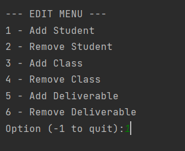

# Gradebook-Project

Created by:

Aidan Languedoc 
 
Annie Liang 
 
Alex Cote and 
 
Andrew Medhi

## SUMMARY

`Gradebook-Project` is a program that allows for the storing of students, 
their classes, and their deliverables while providing 
additional information such as their average 
grade for the entire course and the individual 
assignments

`Gradebook-Project` is comprised of several classes:

`main.cpp`
-
Directly interacts with the user allowing for the creation of new students, grades, and assignments at runtime. 
 
Multiple nested menu's allow for easy access to all sections of the data.
 
Capabilities include
- View Menu
  - Viewing all students and their corresponding information in the `Gradebook`
  - View an individual student's (`Person`) grades
- Edit Menu
  - Add student (`Person`)
  - Remove student (`Person`)
  - Add Class (`Grade`) to a student (`Person`)
  - Remove Class (`Grade`) from a student (`Person`)
  - Add `Deliverable` to a student's (`Person`) class (`Grade`)
  - Remove `Deliverable` from a student's (`Person`) class (`Grade`)
  - Upon closing menu, information is saved automatically to `file`

`gradebook.cpp`
-
Stores the individual students in a `vector` of `Person` along with file name (`string`).
 
This class is responsible for the reading, management, and interaction between the user and data.
 
At runtime a `file` is read containing all information, sending it corresponding data.
 
Comprised of saving a `file`, pushing a new student into the vector, and removing an existing student

`person.cpp`
-
Stores an individual's classes by holding a `vector` of `Grades` along with a student name (`string`).
 
Contains functions for adding and removing new `Grades` to students.

`grade.cpp`
-
Directly holds the `Deliverable` in a 2D `vector` sorting them by their `type` along with a class name (`string`).
 
Has the ability to add and remove `Deliverable` based off of `name` and `type`.
 

`deliverable.cpp`
-
Stores the `name` and `type` of deliverable as a `string`
 
Stores the `pointEared` and `pointTotal` of the deliverable as a `int`
 
`pointEarned` is the amount of points a `person` has achieved on the particular `deliverable`
 
`pointTotal` is the maximum amounts the `deliverable` is worth

## PLANNING

Planning and creation of the project started with a top-down approach of how grades are handled on programs like Gradescope and Brightspace.
 
The core idea structured around having a gradebook hold people, which hold grades, which hold deliverables.
Individual categories of deliverables, such as `labs` would be seperated in a 2D array holding their own type, as to significantly cut down the amount of time it takes to access the proper position in an array if a user were to look for a grade of a category. Further, at runtime when printing all the information,
printing information remains efficient as all information is naturally organized.
A main component as well would be the saving and loading feature, a process that would read from a file at the start of runtime, and save after completing a slough of changes to the data.
 

After determining what we would need to create in terms of classes, we switched over to outlining what functions we would need, aside from setters and getters.
Quickly, it was reasoned that we would need individual push and pop functions for each of the objects as to properly sort the
data into their appropriate vectors, while preventing repeats and handling edge cases, such as removing data that does not exist.
 

After completing this section of code, we turned our attention onto the loading and saving. Losing the data written after creating the code would mean that if a professor were to use this application, they would need to keep it running for a semester.
We determined that the best approach to this would be to have the file save after the data was entered. As seen in the current iteration of the code, upon exiting the edit menu, the file is overwritten and saved with the current data.
The file is composed of two individual symbols to mark a new `person`, `grade`, or `deliverable`. A `$` in front means to push a new `person`, `?` for a `grade`, and if neither symbol are there, it represents a `deliverable`

## COMPILATION INSTRUCTIONS

1. Download project from GitHub, import all files into a project in IDE of choice. CLion was used for writing of this project and is recommended.
2. If there are issues with compilation utilizing CMake, go to `file` and choose `Reload CMake Project`  
    
   
3. Run program.

## RUNTIME INSTRUCTIONS

`Inital Setup`
-

Upon startup, the user will be prompted with the choice to import an existing gradebook file.  
Answering `Yes` or `Y` will ask the user to input the file name. Files do not exist or are unable to be opened will result in another prompt.
 

Answering `No` or `N` will ask the user to input the name of the file they would like to write to. The file name is stored and a file of the chosen name is created.
 

`Main Menu`
-

After the initial set up, the user will be brought to the main menu containing three options.
 
input:
 
`1` to access the `View Menu`
 
`2` to access the `Edit Menu`
 
`-1` to `quit`
 

`Edit Menu`
-

The edit menu is where the user can add or remove data from the file.
 
input:
 
`1` to `Add Student`
 
`2` to `Remove Student`
 
`3` to `Add Class`
 
`4` to `Remove Class`
 
`5` to `Add Deliverable`
 
`6` to `Remove Deliverable`
 
`-1` to `return`

 

`Add Student`
-

Prompts the user for the name of the student to enter.
 
No restrictions on name, but `First` `Last` formatting is recommended for readability.
 

`Remove Student`
-

Prompts the user with a list of existing students.
 
Inputting an index on the menu removes the student from the gradebook.
 
`-1` to abort action.

 

`Add Class`
-

Prompts the user with a list of existing students.
 
Inputting an index on the student menu will prompt the user with a class name to add to the student.
 
Format is recommended as `ClassNum` together.
 
`-1` to abort action.

`Remove Class`
-

Prompts the user with a list of existing students.
 
Inputting an index on the student menu will prompt the user with the classes assigned to that student.
 
Inputting an index on the class menu will remove that class and all deliverables inside from the student.
 
`-1` to abort action.

`Add Deliverable`
-

Prompts the user with a list of existing students.
 
Inputting an index on the student menu will prompt the user with the classes assigned to that student.
 
Inputting an index on the class menu will prompt the user with the option to input the deliverable information.
 
Formatting is `Assignment Name,PointsEarned,TotalPoints,Category Name`
 
If an assignment isn't due or hasn't been handed in, set the `PointsEarned` to `-1` and it will not contribute to the total grade calculations.
 
`-1` to abort action.

`Remove Deliverable`
-

Prompts the user with a list of existing students.
 
Inputting an index on the student menu will prompt the user with the classes assigned to that student.
 
Inputting an index on the class menu will prompt the user with the deliverables belonging to that student in the class.
 
Inputting an index on the deliverable menu will remove the deliverable from the student.
 
`-1` to abort action.

`View Menu`
-

The view menu is where the user can view data within the file along with grade information and calculations.
 
input:
 
`1` to `View All`
 
`2` to `View Individual`
 
`-1` to `return`
 

`View All`
-

Views all information in the gradebook.
 
Classes have their total grade next to them 
 
Categories have the category grade next to them
 
Deliverables have the deliverable grade next to them
 
Grades that have not been handed in (marked on input as EarnedPoints = `-1`) are displayed with a `-` and do not contribute to any scores
 
Classes with no deliverables are marked as `nan%` as no value can be calculated
 
Enter any input to exit
 

`View Individual`
-

Prompts the user with a student menu containing all students in the gradebook.
 
Choosing a valid option will display their classes and deliverables information
 
Refer to `View All` for output formatting
 

`Quit`
-

Inputting `-1` on the `Main Menu` will exit the program.

## SAMPLE INPUT

`Gradebook.txt`
-

This sample input demonstrates the full power of the Gradebook, able to store and access large quantities of Students, Classes, and Deliverables, quickly and efficiently.
 
Each student is modelled using all deliverables from CSC212 
 
student `Aidan Languedoc` features a completely filled out deliverable list
 
student `Annie Liang` features a filled out deliverable list as of `Feb 27 2023`. Actual assignments from this point onward are marked as not due.
 
student `Alex Cote` and `Andrew Medhi` feature a mix of both
 

 

 

 

*all deliverables grades are made up and do not reflect any actual grade of corresponding student*

`Gradebook_2.txt`
-

This sample demonstrates having multiple classes for a student each with various amounts of assignments.

 

 

*all deliverables grades are made up and do not reflect any actual grade of the corresponding student*

`Grades.txt`
-

The sample input created through the runtime tutorial with additional students added.
 
Following the steps should result in similar output.
 

*all deliverables grades are made up and do not reflect any actual grade of the corresponding student*
